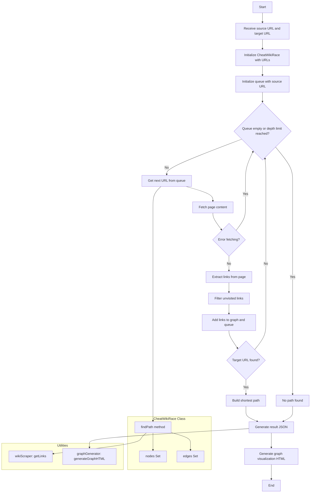

# Cheat-WikiRace

Cheat-WikiRace is a tool designed to automate the process of finding the shortest path between two Wikipedia pages, effectively "cheating" at the WikiRace game.


## Usage

1. Ensure you have Node.js installed on your system.
2. Clone this repository.
3. Navigate to the project directory and run `npm install` to install dependencies.
4. Run the program using one of the following commands: `npm start <source_url> <target_url>` (ex. `npm start https://en.wikipedia.org/wiki/Web_browser https://en.wikipedia.org/wiki/Telnet`)
5. The program will output the found path in the console and generate a `wikirace_graph.html` file with the graph visualization.

## Project Overview

WikiRace is a game where players are given two random Wikipedia pages and must navigate from the source page to the target page using only hyperlinks within articles. The player who reaches the target in the fewest clicks wins.

This tool automates this process by recursively visiting links on pages, starting from the source, until it reaches the target page. It then provides the shortest path between the two pages and generates a visual representation of the search graph.

## Design Specifications

### Input

- Source URL: The Wikipedia page to start from
- Target URL: The Wikipedia page to reach

### Core Functionality

1. The program receives two URLs as input: the source and the target.
2. It retrieves all hyperlinks within the main content of the source page.
3. It recursively visits these links, repeating the process until the target page is found or the depth limit is reached.
4. The program constructs a navigation graph, identifying the path with the fewest links visited.
5. It generates an HTML file with a visual representation of the search graph, highlighting the found path.

### Technical Details

- **Cycle Handling**: Only new, unvisited links are processed to avoid infinite loops.
- **Search Depth**: Limited to 6 levels to prevent excessive execution time.
- **Data Storage**: Utilizes Sets and Arrays for efficient graph representation and navigation.
- **Error Handling**: Errors (e.g., connection issues, 404 errors) are logged, and the program continues as long as there are pages to visit.
- **Language**: Designed to work with English Wikipedia pages.
- **Output Format**: Results are presented in JSON format, showing the path from source to target. Additionally, an HTML file is generated for graph visualization.

### Project Structure

```plaintext
project_root/
│
├── src/
│   ├── index.js
│   ├── CheatWikiRace.js
│   ├── graphGenerator.js
│   └── utils/
│       └── wikiScraper.js
│
├── package.json
└── .gitignore
```

- `index.js`: Entry point of the application.
- `CheatWikiRace.js`: Contains the main logic for the path-finding algorithm.
- `graphGenerator.js`: Handles the generation of the HTML visualization.
- `wikiScraper.js`: Manages the scraping of Wikipedia pages for links.

## Mermaid graph



## Notes

- This tool is designed for educational purposes. Please use responsibly and in accordance with Wikipedia's terms of service.
- The search process may take several minutes depending on the distance between the source and target pages.
